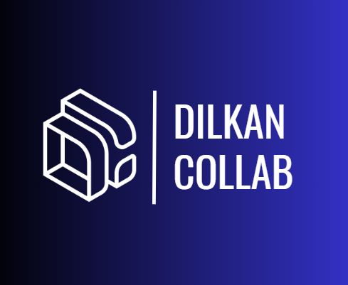

  

# Dilkan Backend

Este es el repositorio del backend de Dilkan, un sistema de gestión de proyectos de desarrollo web.

## Descripción

Dilkan es una plataforma que permite a los desarrolladores web crear, organizar y colaborar en proyectos de manera eficiente. Proporciona herramientas para la creación y edición de proyectos, combinación y visualización de código, compartición de archivos y mucho más.

Este repositorio contiene el código del backend de Dilkan, desarrollado utilizando el framework NestJS y MongoDB como base de datos.

## Requisitos

- Node.js (versión X.X.X)
- MongoDB Atlas (cuenta y clúster configurado)

## Instalación

1. Clona este repositorio en tu máquina local:
